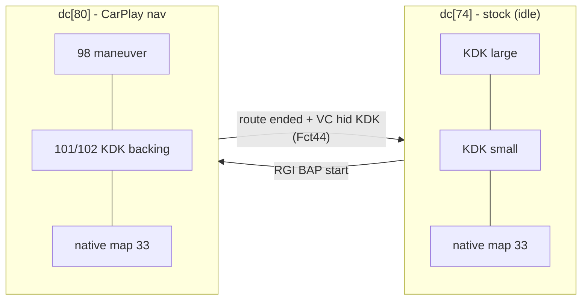
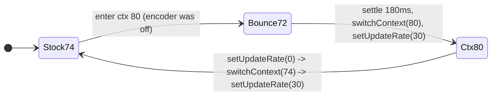

# Cluster display contexts & the switch worker

How the instrument cluster (LVDS2 / terminal 1) is composed, and how the patch owns exactly one
custom context without fighting native nav.

## 📋 Context

> [rgd-activation](../rgd/rgd-activation.md) - setNavActive -> **display-contexts** - switch ctx 74<->80 -> [compositing](compositing.md) -
> HU encodes -> MOST -> VC. Geometry of the planes: [kdk-geometry](kdk-geometry.md).

## 📊 Displayables

| id | owner | role |
|---:|---|---|
| 33 | stock | native cluster map (also in stock ctx 74) |
| 98 | `maneuver_render` | maneuver overlay, **transparent when idle** ([maneuver-renderer](maneuver-renderer.md)) |
| 101 / 102 | stock (987 Image backings) | KDK backing planes (sport / popup) |

`maneuver_render` opens a managed screen window with `ID_STRING="98"` via `cluster_surface`
(raw `screen_create/manage_window`, no `libdisplayinit`). Id 98 has **no stock owner**, so there is
no last-writer-wins war with native nav - see [compositing](compositing.md).

## 🧭 Contexts (A5-class; declared in `DisplayManagerMIB2High.defineContexts`)

- **dc[74]** `CTX_MAP_KDK` (stock) - native map + KDK; the cluster's resting state.
- **dc[80]** `CTX_CARPLAY_NAV` = `{98, 101, 102, 33}` - our maneuver over the KDK backings over the
  **stock native map**. z-order = array order (index 0 = front).

`getMappedInternalContext` is identity on MIB2High, so `switchContext(80)` lands on exactly the
declared context. G24 clusters have no such composition and the feature is disabled there.

## ⚙️ The switch worker (single serialized writer)

`ScreenModule` runs **one** persistent worker - the sole caller of `switchContext` / `setUpdateRate`,
so two switches can never race:

- `desiredCtx = (connected && navActive) ? 80 : 74` - pure function, worker converges to it
  (reconciled every 250 ms).
- `navActive` is set by `RouteGuidance` on a successful BAP start ([rgd-activation](../rgd/rgd-activation.md)). On route end
  `setNavActive(false)` keeps it true (`navHidePending`) while `ClusterLayerController.isKdkVisible()`,
  i.e. while the VC is still fading its KDK out; `onVcKdkVisibility(false)` (FctID 44) then releases it.
  If the KDK is already hidden, the release is immediate. There is no hold timer.
- Entering 80 from stock needs a real context change first, so the worker **bounces** through ctx 72
  (`CTX_MAP`, kombi-map - never ours) for 180 ms, then switches to 80 and sets 30 FPS. This forces
  `preContextSwitchHook` + the MOST encoder re-point that `switchContext` otherwise short-circuits.
- `isClusterContextWriterThread()` lets `DisplayManagerMIB2High` distinguish our serialized writes
  from stock screen-controller requests while CarPlay owns terminal 1.

On disconnect the worker restores stock 74 (and clears any pending hide); it is never killed, so no
stale per-session worker can outlive its session. Layer opacity inside ctx 80 is
`ClusterLayerController`'s job - see [kdk-geometry](kdk-geometry.md).
