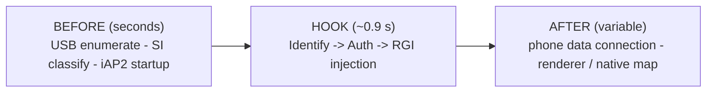

# CarPlay session lifecycle & resilience risks

## 📋 Context

> `smartphone_integrator` (phone connect) -> **carplay_startup.sh** -> `carplay_monitor.sh` + `exec dio_manager`
> owns the lifecycle: see [supervisor-lifecycle](supervisor-lifecycle.md) for renderer ownership and [connect](connect.md)
> for why the NCM link churns. The cluster context switch these modules drive is [display-contexts](../cluster/display-contexts.md).

This note carries the **shipping-relevant** half of the RE session-lifecycle audit. The audit's
altScreen/cluster-video findings (stream-111 RTSP, the `-6030`/`-6031` port collision, the
loader->video Adreno handoff, the OMX back-pressure budget) are **excluded**: this branch ships **no
cluster altScreen** - there is no `altscreen_hook`, no `altscreen_render`, no `AltScreenModule`, and
no stream-111 listener anywhere in the tree. The cluster shows the head unit's own native map with a
transparent [maneuver overlay](../cluster/display-contexts.md) composited over it, not a decoded iOS video plane.

## 🔍 Watchdog hang is a separate class from any RTSP trigger

The audit's diagnostic rule survives independent of altScreen: an SI `TIMEOUT_WATCHDOG` (the
`watchdogTimeout` fires) is a **distinct failure class** from whatever protocol-level event triggered a
given teardown, and must be diagnosed on its own evidence rather than folded into the trigger. The
altScreen command-path mechanism the audit named as the strongest code-forced cause of the watchdog
symptom (an `alt_lock` held across a stock `AirPlayReceiverSessionSendCommand` while TearDown wanted
the same lock) **does not exist on this branch** - that lock and that command path are altScreen-only.

What is verified here is the SI supervision envelope that bounds a hang (`carplay_child.json`):

| Knob | Value | Meaning |
|---|---:|---|
| `startupTimeout` | 10 000 ms | budget from SI spawning `carplay_startup.sh` to `dio` being up |
| `stopTimeout` | 8 000 ms | graceful stop budget (not the old 2 s graphics-thrash value) |
| `restartDelay` | 3 000 ms | inter-generation delay (not the old 500 ms) |
| `watchdogTimeout` | 60 000 ms | SI liveness watchdog on the tracked `dio` PID |

These are the non-thrash timings; the wrapper never restarts the Java stack, and every millisecond
before `exec dio_manager` is taken from the 10 s startup budget - which is why renderer adoption runs
**in the background monitor**, never in the wrapper before `exec` (see R4 and [supervisor-lifecycle](supervisor-lifecycle.md)).

## 🔍 Independent pre-RTSP failure class: USB enumeration (!)

Some "nothing starts until replug" runs fail **before** any RTSP/control SETUP: USB reports both iAP2
interfaces matched but only one running (`drivers_matched::2` + `drivers_running::1` in
`/ramdisk/pps/device/usb-1.0.1`). This is not the RTSP path - the hook, Java patch and renderer have
not entered the failing transaction yet - so it stays a separate failure class.

**No automatic recovery ships.** A guarded one-shot `reset port 3 250 1` to `/dev/media-con-ctrl` was
tried and measured on the car to make the state worse (`drivers_running` 1 -> 0), so it was removed.
`smartphone_integrator` stays the sole owner of OTG/USB; the supervisor never touches it
([supervisor-lifecycle](supervisor-lifecycle.md#-no-usb-recovery-in-the-supervisor)).

## 🧭 Captured healthy activation timeline (!)

From `log/live_20260812_0004` - evidence that the **hook itself adds no multi-second latency**
(sub-second from Identify to RGI injection). Only the shipping-relevant, non-altScreen spine is kept:

| Time | Event |
|---|---|
| `00:00:47.093-47.112` | iAP2 Identify accepted / patched |
| `00:00:47.433` | authentication path active |
| `00:00:48.016-48.041` | initial RGI injection queued / succeeds |

(!) Log evidence, not code - it is a per-boot property, re-verified on-unit, not a build invariant.
Latency *before* this window belongs to USB/SI/iAP2 startup; latency *after* it belongs to the
phone's data connection and the cluster renderer, never to the hook.

## ⚠️ Resilience risks

Each risk is validated against current code and marked [x] (matches / class absent on this branch) or
(!) (open, or needs an on-unit fault replay to prove).

### R1 - infinite accept relies on cross-thread close [x]

The audit's stream-111 C-hook accept is altScreen (excluded). The shipping analog is
`RendererServer.acceptLoop()`: `ServerSocket.accept()` blocks forever on a dedicated
`RendererServer-Accept` daemon; `dispose()` closes the `ServerSocket` from another thread to wake it
and then `acceptThread.join(500)`. Teardown is therefore **bounded** (500 ms join), and it relies on
the JVM waking a blocked `accept()` when its listen socket is closed - standard, reliable semantics on
this platform. (!) still worth the on-unit replay: repeatedly dispose while a renderer connect is racing
the accept, and confirm the accept thread always exits.

### R2 - a live callback can outlive its stock session [x] (class absent)

The audit's case was altScreen `alt_refresh_night_mode()` dereferencing the stock session/server from
the receive thread on the first IDR, which could race a teardown that frees the session. **No such
path ships here.** Every stock-facing cluster callback - `ScreenModule.setNavActive()`,
`CombiMapController.processModelUpdateEvent()`, the steering-wheel roller press - only flips a
`volatile` flag and wakes a worker; none makes a synchronous call back into a stock session object
from an I/O thread. The unsafe lifetime contract has no instance on this branch.

### R3 - synchronous Java writes on stock callbacks [x]

The audit flagged `AltScreenModule.setViewAreaMode()` writing-and-flushing both a renderer control
socket and the hook bus directly from stock HMI/BAP callbacks. Those classes are **deleted**. What
ships:

- `RendererServer` (`:19800`) and `CarplayBus` are **enqueue-only**: BAP/HMI callers push one fixed
  packet onto a bounded **32-entry drop-oldest** ring and return; a single dedicated writer thread
  owns the blocking socket write, and connection generations discard packets queued for a preempted
  peer.
- `CombiMapController.processModelUpdateEvent()` now calls `ScreenModule.setViewAreaMode()`, which
  only flips `smallScreenViewArea` and notifies its listener. KDK stage geometry follows VC's
  Fct54/Fct44 in `ClusterLayerController`, not the view-size event.

### R4 - stale-renderer replacement eating the SI startup budget [x]

Renderer adoption runs in **`carplay_monitor.sh`, in the background, while the wrapper `exec`s
`dio_manager`**, so it costs **nothing** from dio's 10 s `startupTimeout` (`start_renderer`). Only
`maneuver_render` exists (no altScreen renderer). An adopted renderer that fails the identity check is
re-checked after 2 s, then replaced with a **1 s** TERM grace (`cp_kill_renderer "$MON_NAME" 1`).
`dio` churn never kills the persistent renderer at all.

## ✅ Cleared as primary session killers [x]

- **Java CarPlay activation** - hot TerminalMode `onActivate`/`onDeactivate` callbacks only store the
  desired generation and `notifyAll()`. A single persistent `carplay-lifecycle` daemon
  (`CarPlayApp`) serializes module stop/start, applies a **400 ms deactivate debounce**, and retries
  late services (Navigation can appear long after TerminalMode on cold boot) indefinitely. The former
  ABBA lock order is gone - `startPass()` never holds the small state lock across `Module.start()`.
- **Renderer transport** - `maneuver_render` is a client of Java's route-scoped `:19800`; Java writes
  to it on a dedicated writer, so a dead renderer never synchronously blocks stock HMI. A wedged
  Adreno path can leave the cluster overlay dead but cannot produce a stock session teardown.
- **SI stop/restart timings** - `stopTimeout=8000` / `restartDelay=3000` are no longer the old
  2 s / 500 ms graphics-thrash configuration.

## 🧪 Ranked on-unit validation plan (!)

Code corrections are in; release is gated by destructive/fault timing that cannot be proven off-unit.
altScreen-only items from the source plan are dropped.

1. **Cold boot + ten rapid unplug/replug cycles.** Every successful activation must come up with no SI
   60 s `watchdogTimeout` and no stuck `dio` generation.
2. **Renderer accept/teardown churn.** Delay/deny the renderer's `:19800` connect and force repeated
   route stop / disconnect; require `RendererServer` to keep accepting, its accept thread to exit on
   `dispose()`, and SETUP-side hook time to stay under the SI budget.
3. **Kill/restart `maneuver_render` while a maneuver is live and while it is starting.** `dio_manager`
   must stay alive; the renderer may exit and be restarted (5 s backoff) with the cluster falling back
   to stock ctx 74.
4. **Stall/disconnect the Java transport while spinning the steering-wheel controls.** HMI callbacks
   and the SI watchdog must stay responsive; stale generation commands must be discarded on reconnect.
5. **Reproduce the USB PPS mismatch before any control SETUP.** Require the supervisor to leave USB
   alone (no `reset port`) and record whether SI's own retry recovers it.

## 📋 Lifecycle matrix

altScreen phases (RTSP control negotiation, 111/110 listener setup, active 111 video) are dropped.

| Phase | Verdict | Evidence / remaining validation |
|---|---|---|
| USB attach & SI classification | (!) SI-owned | No supervisor USB reset (measured to worsen it); SI's retry is the only recovery |
| Wrapper before `exec dio_manager` | [x] startup budget hardened | Adoption inside the monitor; initial stale-renderer grace 1 s; persistent renderer never kill/recreated |
| iAP2 Identify / Auth / RGI | [x] no session blocker | Sub-second in the captured healthy timeline; injection worker is generation-aware/bounded |
| Renderer transport (`:19800`) | [x] blocking paths isolated | Enqueue-only callers, one writer thread, generation-scoped drop-oldest |
| Per-generation / full teardown | [x] bounded | `dispose()` closes listener cross-thread, `join(500)`; no stock call held under a lock |
| Fast reconnect / generation ownership | [x] structurally hardened | Lifecycle worker coalesces edges (400 ms debounce); connection generations discard stale writes |
| Java / HMI lifecycle | [x] callback I/O removed | Socket/bus I/O owned by bounded daemon writers; stock callbacks only publish state |
