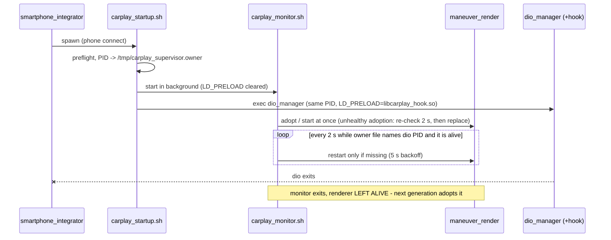

# Supervisor & renderer lifecycle

`carplay_startup.sh` is configured as `children.carplay.exec` in `smartphone_integrator.json`. It is a
thin wrapper: it publishes its PID as the current generation, starts `carplay_monitor.sh` for that
generation and `exec`s `dio_manager` with the hook. The monitor owns `maneuver_render`; nothing here
ever restarts the Java stack or touches USB/OTG.

## 📋 Context

> `smartphone_integrator` (phone connect) -> **carplay_startup.sh** -> `carplay_monitor.sh` +
> `exec dio_manager` (with LD_PRELOAD) - adopts/starts `maneuver_render`. Why the NCM link churns:
> [connect](connect.md).

## 🚀 Install

What goes where on the unit, the M.I.B. installer, the manual install and the uninstall are in
[install](install.md). The runtime-relevant facts: the four `carplay_*.sh`, `libcarplay_hook.so`,
`maneuver_render` and `flag_atlas.rgba` live in `/mnt/app/root/hooks/`; `children.carplay` in
`smartphone_integrator.json` is replaced by `carplay_child.json`; `dio_manager.json` must list the
route-guidance IDs `0x5200`-`0x5204`; and the stock `/etc/scripts/carplay_cleanup.sh` is never
overwritten (the custom cleanup calls it for Audi's mdnsd/PPS teardown).

## ⚙️ Ownership rules

- `children.carplay.envs` carries **no** `LD_PRELOAD`; the wrapper exports it only right before
  `exec dio_manager`, and starts the monitor with it cleared - so neither the shells nor the renderer
  load the hook.
- **Preflight** before anything is published: `dio_manager`, `libcarplay_hook.so`,
  `carplay_monitor.sh` and `carplay_processes.sh` must exist, else the wrapper logs and exits 127.
- The wrapper **`exec`s** `dio_manager` so SI tracks the exact dio PID (keeping the shell as parent
  made SI kill/relaunch wrappers and the cluster never rose).
- **Generation ownership:** the wrapper writes its PID to `/tmp/carplay_supervisor.owner` atomically
  (stage file + `mv`). A monitor acts only while `monitor_current` holds - the owner file names its
  dio PID **and** that PID is alive. A newer generation overwrites the file, so an older monitor
  goes quiet at once instead of fighting over the renderer.
- The monitor adopts or starts `maneuver_render` **immediately** (no settle sleeps: the renderer never
  gates dio, and it must be ready before Java selects the cluster context). Then every 2 s it
  restarts a missing renderer after a 5 s backoff, re-checking ownership before it spawns, and caps
  `/tmp/maneuver_render.log` and `/tmp/carplay_wrapper.log` at 512 KiB about every 5 min.
- When dio exits the monitor exits too and **leaves `maneuver_render` alive**, so a replacement
  inherits the existing EGL allocations instead of re-entering fragile Qualcomm `eglInitialize`.
  The monitor never signals `dio_manager`.

## 🔍 Adoption is by live PID

`maneuver_render` is a **client** of Java's route-scoped `:19800` listener, which Java deliberately
closes when RGI is inactive. So process identity - not a socket probe - is the health check
(`cp_renderer_healthy`); treating the closed listener as "unhealthy" would kill/recreate the EGL
context every reconnect.

The PID lives in `/tmp/carplay_maneuver_render.pid`. The steady path is one `/proc/<pid>` lookup
(`cp_renderer_running`); only a missing or stale entry costs a `pidin ar` scan
(`cp_renderer_adopt`). Identity is `pidin -p <pid> ar` (`cp_renderer_identity`: match, different
process, or unknown). An adopted renderer that fails the identity check is re-checked after 2 s and
only then replaced; `cp_kill_renderer` re-checks identity before SIGTERM and again before SIGKILL, and
an unknown answer keeps the process.

## 🔄 No USB recovery in the supervisor

The supervisor does not reset USB. An earlier version queued a one-shot `reset port 3 250 1` to
`/dev/media-con-ctrl` for the pre-SETUP state where only one of the two iAP2 interfaces runs
(`drivers_matched::2` + `drivers_running::1`). Measured on the car, the reset made it worse
(`drivers_running` 1 -> 0), so it was removed along with the global stop marker and the stop-time
renderer teardown. `smartphone_integrator` stays the sole owner of OTG/USB and `dio_manager`.

## ⚙️ Cleanup is identity-less

`carplay_cleanup.sh` does not know which dio generation it runs for, so it must **not** stop
renderers by the shared PID file (that could hit a replacement generation's renderer). It only
invokes Audi's stock `/etc/scripts/carplay_cleanup.sh` for mdnsd/PPS cleanup. The renderer exits only
on its own failure, a reboot or an explicit maintenance action.

QNX-6.5 `/bin/sh` compatibility: numeric signals, `pidin` finite snapshots (no blocking
`/proc/*/cmdline` walk), no GNU-only tools.

## 🧪 Tests

`scripts/test_supervisor_lifecycle.sh` runs the real `carplay_startup.sh` and monitor functions
against host fakes (PID publish, hook scoping, `exec` of dio, start/adopt/replace, no USB/OTG or dio
control); `tests/renderer_pid_identity_test.sh` covers the PID registry, adoption and identity
helpers and runs from the former. Both are part of `scripts/run_tests.sh`.
