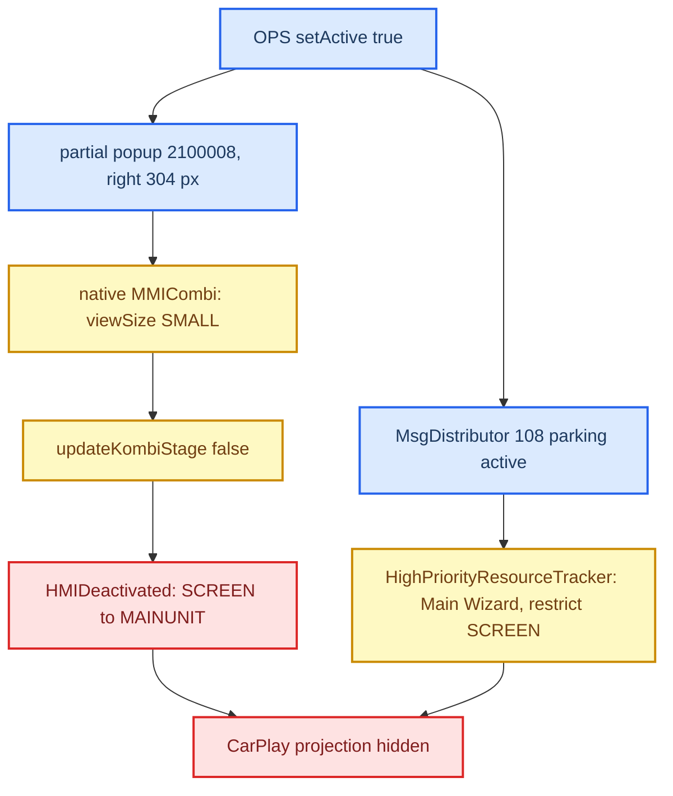

# PDC small stage - CarPlay beside the parking popup

*Why stock hides CarPlay when the right-hand parking (PDC/OPS) popup appears, the two stock chains
that cause it, and the narrow Java guard that keeps CarPlay visible beside the popup. This is the
head-unit screen, not the cluster; it is independent of route guidance.*

---

## 📋 Status

The guard is the same code as in mhi2-carplay (ported unchanged). The car results below were
recorded there.

| Stage | Result |
|---|---|
| small-stage guard + AP 1002 | CarPlay stayed under the right OPS popup **[car]** |
| parking message 108 from plain OPS, passive-PLA classification, AP ordering | host-tested |
| "Check surroundings!" APS drawer hidden | drawer gone **[car]** |
| status line 62 hidden during pure OPS | clock/LTE line gone **[car]** |
| entertainment drawer follows 62 | host-tested only, not yet confirmed on the car **[open]** |

> [!IMPORTANT]
> Intended presentation: with the partial popup beside CarPlay there are **no** bottom strips at all -
> no status line, no APS warning drawer, no entertainment drawer. Reverse gear still opens the
> full-screen camera (stock takeover).

## 🔍 Root cause - a policy clash, not a drawing bug

**The popup itself is harmless.** Pure OPS shows `ParkingPopupIdentifier(1, 2100008)` via
`hmiService.showPartialPopup(0, 2100008)`: bounds `(720,0,304,480)`, HMI layer 3, slot 4, type 7
(unbound partial). Volume and massage popups use the same `PartialPopupController` and never hide
CarPlay.

**Path 1 - small stage.** Parking policy sets `viewSize = 1` (SMALL).
`MMICombiStageListener.viewSizeChanged(1)` -> `updateKombiStage(false)` ->
`ExternalEventsListener.hmiDeactivated()` -> `HMIDeactivated` gives `Resource.SCREEN` to `MAINUNIT`.
The CarPlay screen `TERMINALMODEIPODOUT` (ID `3200000`) is built with `setSmallStageType(1)` =
`SMALL_STAGE_OMISSION`: in small stage it is dropped, not resized.

**Path 2 - message 108.** `AbstractParkingSystemOPSComponent.setActive(true)` ->
`MsgDistributor.sendMessage(108)` (107/108 = parking system off/on), delivered synchronously and
**before** the popup request. Stock `HighPriorityResourceTracker.processMsg(108)` flips
`SWITCH_TO_MAIN_WIZARD_CHOICE`, blocks the smartphone screen and restricts `SCREEN` to `MAINUNIT`.

Full-screen VPS/RVC (camera) is a genuine takeover and must stay stock.

## ⚙️ The guard in code

- **`pdc/PdcSmallStageGuard`** - state for popup `2100008` on terminal 0. Before `showPartialPopup` it
  switches the live CarPlay screen `3200000` from `SMALL_STAGE_OMISSION (1)` to
  `SMALL_STAGE_NO_CHANGE (6)` and restores it on hidden/removed/unregister/deinit, or when an
  unconfirmed show request expires after **3 s** (`SHOW_REQUEST_TIMEOUT_MS`).
- **Classification.** Allowed only for the OPS DSI popups `1`, `4`, `7`, `17` with exactly one OPS
  (system 2) on partial `2100008`, plus at most one **passive** PLA (`isSystemActive()` false) - a
  plain side OPS legitimately arrives as `[OPS=2, PLA=16]`. Camera/VPS, ARA, `OPSFLANKGUARDPLA (15)`,
  trailer-assist mode 12 and unknown combos keep the stock takeover.
- **`ParkingSystemControllerComponentEvo`** (stock replacement) overrides
  `deactivateCurrentlyVisibleParkingSystems`, which runs before anything is activated, so the guard is
  armed before 108; a non-OPS system revokes it.
- **`HighPriorityResourceTracker`** (full stock replacement) - for an allowed standalone OPS, 108
  neither switches the Main Wizard nor takes SCREEN (log `OPS 108: keep CarPlay SCREEN; no Main Wizard
  takeover`); eCall/clamp-S restrictions stay stock.
- **`ExternalEventsListener`** - `updateKombiStage(false)` and AP 1002 skip `HMIDeactivated` only
  while CarPlay is active, the guarded popup is up on the same protected screen instance and no screen
  change is pending; `hmiActivated()` restores the CarPlay key handler at BIG stage.
- **`ParkingPartialPopupHandler`** - arms the guard before the show (SMALL can arrive before
  `partialPopupVisible`); `partialPopupHidden` cancels only a matching popup on the main terminal.
- **APS drawer** ("Check surroundings!", drawer content 6001/6002, model 538) -
  `AudioDrawerContextImpl` + `pdc/OpsAudioDrawerPolicy` publish `INACTIVE` for column 0 only while
  protected and republish the last stock value on release.
- **Status line 62** - `PartialPopupManagerEvoHigh` hides popup 62 before showing `2100008` and
  answers HIDDEN to a repeat `showPopup(62)` or queue replay, only for the protected screen.
- **Entertainment drawer** - stock `StatusBarStubController.updateStatusBar()` toggles 62 and the
  drawer together; parking sets choice 3915=1, which switches the CarPlay screen's stub to render the
  bar. The patched `StatusBarStubController` turns a drawer-visible request into hidden while the
  guard holds; `PartialPopupManagerEvoHigh.hideFooter()` hides both when OPS opens.
- **Disconnect** - `CarPlayApp` calls `PdcSmallStageGuard.carPlayDisconnected()` on the lifecycle
  worker, so the OPS screen and APS drawer are restored even without another HMI event.

**Do not** globally pin a display context or opacity (breaks HOME and the full camera), ignore every
108, or rely on `getCurrentDisplayContent()` alone (stock updates it after `activateParkingSystem`).

## ✅ What to check on the car

Side OPS leaves nothing at the bottom of CarPlay and its bottom buttons work; reverse gear opens the
full-screen camera; HOME and the camera show the stock footer; leaving reverse returns to CarPlay.

With `/mnt/app/carplay_verbose` created **before** Java starts (the Java `Log` reads the marker only at
init), the logs show: `[ParkingPartialPopupHandler#showPopup] popupID=2100008` (stock HMI logger) ->
`OPS guard: screen 3200000 smallStageType 1 -> 6` -> `…SMALL_STAGE pure OPS: keep CarPlay SCREEN owner` -> `parking intent popup=… standaloneOPS=true`
-> `OPS 108: keep CarPlay SCREEN…`; on close `BIG_STAGE` -> `HMIActivated` -> `OPS guard: restored … 1`.
HOME, the full camera and an active PLA must still show `HMIDeactivated.execute`.

## 🧪 Tests

`scripts/test_pdc.sh` (also run by `scripts/test_java_transports.sh`) runs the shipping jar against
the real stock MU1316 classes with the physical HMI faked:

| Test | Covers |
|---|---|
| `PdcResourcePolicyTest` | real OPS/PLA/VPS popup tables, stock `activateParkingSystem` lifecycle, 4 -> 1 -> 7 -> 17 -> 1 updates |
| `PdcExternalEventsTest` | real `DebounceOperation`, AP ordering, eCall/clamp-S, deinit races |
| `OpsAudioDrawerTest` | model 538 -> content 6001/6002, restore on release |
| `OpsStatusLineTest` | popup 62 show/hide/queue with OPS, HOME, camera, disconnect, timeout |
| `CarPlayPdcLifecycleTest` | real `CarPlayApp` disconnect without an extra HMI event |

Stock-first negative controls reproduce the original failures: `pure OPS 108 toggled Main Wizard`,
the APS 6001 warning and `MMI status line 62 remained over CarPlay`. None of this runs Kanzi or the
native compositor, and the entertainment-drawer path has no host fixture.
