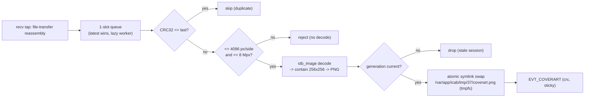

# Cover-art bridge (iAP2 artwork -> VC picture)

Stock MHI2Q CarPlay forwards title/artist/album to the VC but never pushes cover art, so the VC shows
a blank album icon. This bridge fills it in.

## 📋 Context

> Cinemo `NmeTransport::Recv` -> **cover-art** - reassemble + decode -> tmpfs PNG + `EVT_COVERART` ->
> [bus-protocol](bus-protocol.md) -> Java `CoverArt` -> `AppConnectorTerminalMode` picture mgr -> VC.

## ⚙️ Reassembly (on the iAP2 receive thread)

The module taps the Cinemo transport at **`NmeTransport::Recv`** (the framework's `on_transport_recv`
sink, not a global `recv` scan) and feeds every delivery to `coverart_stream_feed()`
(`coverart_stream.c`). It is a passive reader of the iAP2 **File Transfer** session - no ACKs, no
writes - and never looks for JPEG markers in the byte stream:

- **Link framing:** `FF 5A` packets, header and payload checksums verified; packets split across
  deliveries are buffered (up to one 64 KiB link packet).
- **Sessions:** SYN/RST starts a new link generation and drops every transfer; the SYN's session list
  tags each session ID, so only file-transfer (or untagged) sessions carry artwork.
- **Order:** data packets are applied in sequence order, wrap-safe; duplicates and old packets are
  dropped, out-of-order ones held until the gap fills (1 MiB budget - above it the incomplete
  transfers are abandoned, never spliced across a gap).
- **Files:** per file ID. Setup may be size-only (8 bytes, what a live iPhone sends) or typed
  (10+ bytes, then the type must be artwork); first/continue/last data opcodes build the file,
  cancel/success/failure drop it. At most 4 transfers in flight (oldest evicted), 800 000 bytes each,
  never more than the Setup size. The file must start with a JPEG or PNG signature and is complete only
  on the last-data opcode with the full size; of several completions only the newest is kept.

A new iAP2 Identify (`coverart_reset_recv_stream`) resets the stream, bumps the receive generation and
drops a pending image.

## 🔄 Async decode worker

The complete image is handed to a **worker thread**, created lazily on the first complete image
(single-slot queue, latest wins). If the thread cannot be created, the image is dropped: the receive
thread never decodes.

- **Pre-decode budget:** `stbi_info_from_memory` reads the header and
  `coverart_image_dimensions_safe()` (`jpeg_safety.c`) rejects more than 4096 px per side or 8 Mpx in
  total **before** `stb_image` allocates the pixel buffer. Input is 500-800 000 bytes.
- **Orientation:** `coverart_jpeg_orientation()` is a bounded EXIF parser (every offset checked
  against the segment); it returns 1-8 or 0. Only orientation 4 (vertical flip) is applied.
- **Stale images:** a decode that finishes after an Identify reset is discarded by generation, so an
  image from a previous session never overwrites the current one.

This keeps the ~50-100 ms decode off the iAP2 hot path. `stb_image` is vendored; decode runs only on
this single worker (no libc reentrancy issues in an `LD_PRELOAD` .so). The PNG lives on tmpfs -
regenerated each session, lost on reboot (fine: the pipeline restarts every CarPlay handshake). The
`coverart.png` path is a symlink ping-ponged between `coverart_0.png` / `coverart_1.png` and swapped
atomically via `rename()`.

## ⚙️ Java side

`CoverArt` subscribes to `EVT_COVERART`, dedups by CRC, and `AppConnectorTerminalMode` pushes the
image to the BAP picture manager (`ResourceLocator` + `responseCoverArt()`), mirroring the native
`AppConnectorMedia` pattern. Late-arriving art (after track info was already sent) is re-pushed with a
tweaked picture id to force the VC to refresh.

## 🧪 Tests

`scripts/run_tests.sh` builds three host tests: `coverart_stream_test` (fragmentation, batches, file
IDs, checksums, reorder/wrap, bounds, untyped Setup), `coverart_safety_test` (EXIF parser and
dimension budget on malformed input) and `coverart_pipeline_test` (the real decode/publish path with an
Identify reset during encoding).
