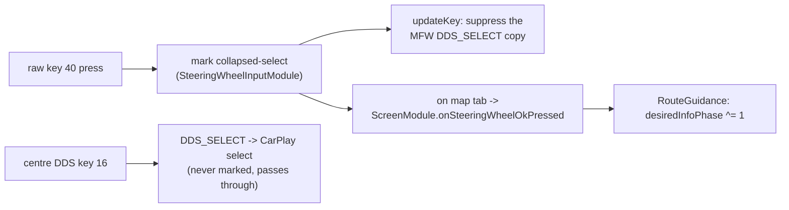

# Steering-wheel roller - zoom & route-info toggle

The left MFW roller has two axes: **rotation** and **press**. On this branch the cluster shows the
stock native map, so rotation is left to stock; only the press is repurposed.

## 📋 Context

> MFW roller -> **rotation** = stock native-map zoom - **press** = cluster route-info toggle ->
> [bap-fctids](../rgd/bap-fctids.md) FctID 19 -> [rgd-activation](../rgd/rgd-activation.md).

## 🔄 Rotation (zoom) -> stock

The roller sends rotation as Navigation-BAP `MapScale.steps`. Since the cluster renders the stock
native map (no CarPlay video plane to zoom), `ScreenCombiBAPListener` does not override `setMapScale`:
the step falls through to stock, which zooms the native cluster map exactly as stock does. (The
listener only observes FctID 44 visibility and FctID 54 stage for the KDK layers - see
[kdk-geometry](../cluster/kdk-geometry.md).)

## ⚙️ Press (OK) -> route-info toggle

The raw MFW roller press (DSI key 40, `KEY_MFW_ROLLER_LEFT`) and the centre-console DDS (key 16,
`KEY_DDS`) both collapse to the same `DDS_SELECT` in the stock keyboard stack. `SteeringWheelInputModule`
observes the raw `ATTR_KEY2` stream and marks only key 40, so `CarplayDSILifecycleController.updateKey`
can **suppress that one copy** of `DDS_SELECT` before it reaches iOS (via `consumeCollapsedSelect`) -
the centre knob still selects in the CarPlay Main UI.

Gated to the confirmed VC map tab, the press then calls `ScreenModule.onSteeringWheelOkPressed()` ->
`RouteGuidance` toggles the cluster route-info line between the **next turn-to street** (phase 0) and
the **trip summary** (ETA / arrival clock + remaining, phase 1). Phase 1 falls back to phase 0 by
itself 20 s after it was published. Text layout: [vc-route-text](../rgd/vc-route-text.md) (FctID 19).

