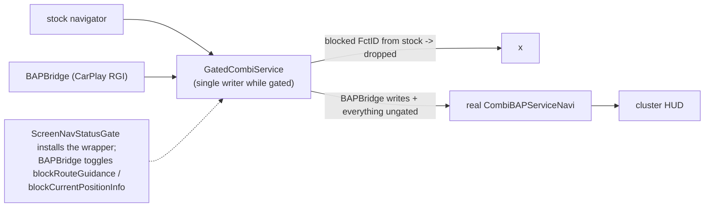

# Navigation BAP FctID matrix (LSG 0x32)

Which Navigation-BAP functions the patch **drives** while CarPlay route guidance is active, and which
stay delegated to the stock navigator. Full stock catalogue: [navsd-catalogue](navsd-catalogue.md).

## 📋 Context

> [rgd-activation](rgd-activation.md) - decide active -> **bap-fctids** - publish FctIDs -> cluster HUD +
> [compositing](../cluster/compositing.md) - maneuver overlay

## 🔐 Ownership gate

`GatedCombiService` wraps the stock `CombiBAPServiceNavi`; `ScreenNavStatusGate` installs it and
`BAPBridge` toggles two flags so BAPBridge is the single writer for route-guidance FctIDs:

- `blockRouteGuidance` - drops stock writes to the maneuver FctIDs (17/18/23/24/39/49/55).
- `blockCurrentPositionInfo` - drops stock writes to the road/lower-bar text FctIDs (19/20/21/22/46).

See [rgd-activation](rgd-activation.md) for when these flip. Everything else always delegates to stock.

## 📊 CarPlay-owned / gated FctIDs

| FctID | Hex | Name | Role | Notes |
|---:|---:|---|---|---|
| 17 | 0x11 | RG_Status | route-guidance active; starts FctSync | sent during RGI |
| 18 | 0x12 | DistanceToNextManeuver | next-turn distance **+ bargraph** | same level drives the renderer arrow fill, [bargraph-sync](bargraph-sync.md) |
| 19 | 0x13 | CurrentPositionInfo | all CarPlay route text (<= 96 B UTF-8, scrolled) | gated by `blockCurrentPositionInfo`; [vc-route-text](vc-route-text.md), OK toggle -> ETA ([steering-wheel](../input/steering-wheel.md)) |
| 20 | 0x14 | TurnToInfo | turn-to / signpost text | sent as `("", "")` during RGI; stock writes gated by `blockCurrentPositionInfo` |
| 21 | 0x15 | DistanceToDestination | trip distance | gated during RGI |
| 22 | 0x16 | TimeToDestination | absolute arrival clock | always `timeInfoType = 1` (type 0 blanks the VC block); HU local TZ, dest-TZ TLV 0x15 unused ([rgd-tlv](rgd-tlv.md)) |
| 23 | 0x17 | ManeuverDescriptor | up to 3 maneuver slots | [maneuver-mapping](maneuver-mapping.md) |
| 24 | 0x18 | LaneGuidance | lane arrows | from 0x5204, shared gate with the renderer panel, [lane-guidance](lane-guidance.md) |
| 39 | 0x27 | ActiveRGType | guidance presentation type | sends `0` (BAP RGI) |
| 46 | 0x2E | DestinationInfo | destination detail | gated during RGI |
| 49 | 0x31 | Exitview | junction/exit-view + FctSync member | EU<->NAR variant toggled, `exitViewNum` always 0 |
| 55 | 0x37 | ManeuverState | maneuver transition state | sent |

## 💡 FctSync (37) is implicit

`FunctionSynchronisation` (FctID 37) atomically syncs FctID 17/18/23/49 - never written directly.
`BAPBridge` toggles the cosmetic Exitview (49) variant to force a transmission when the stock
`sendStatusIfChanged` would otherwise dedup a descriptor or bargraph update.

## 🧭 VC -> HU inputs (44 / 54)

The VC's own FctID 44 (MapViewAndOrientation, KDK visibility) and FctID 54 (Map_Presentation, KDK
stage) stay stock-owned, but `ScreenCombiBAPListener` forwards the accepted values to
`ClusterLayerController` **before** stock acknowledges them (`updateMapVisibility` ->
`onVcVisibility`, `setMapPresentation` -> `onVcPresentation`). They drive KDK layer opacity/stage, the
renderer viewport and the end-of-route context hold - see [kdk-geometry](../cluster/kdk-geometry.md).

## 🧭 Scale (45) & altitude (47) pass through

FctID 45 MapScale and 47 Altitude are the native map's lower-bar readouts. The cluster shows the
stock native map, so they stay visible: `GatedCombiService.updateMapScale` / `updateAltitude` always
delegate to stock (never gated on this branch), and `setRouteGuidanceBlocked` does not hide them. The
steering-wheel roller drives stock native-map zoom - see [steering-wheel](../input/steering-wheel.md).
