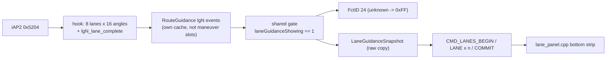

# Lane guidance - HUD FctID 24 & renderer lane panel

Lanes are an **independent event**, not part of the current maneuver: they can appear, vanish or
switch inside one maneuver. Both outputs - BAP FctID 24 for the HUD and a lane strip at the bottom of
the `maneuver_render` overlay - use the same gate and the same raw event.

## 📋 Context

> [rgd-tlv](rgd-tlv.md) - 0x5204 -> **lane-guidance** - shared gate -> [bap-fctids](bap-fctids.md) FctID 24 +
> [maneuver-renderer](../cluster/maneuver-renderer.md) lane panel

## 🔐 Gate

`laneGuidanceShowing == 1 && !(maneuverCount == 0 && routeState <= 0)` - nothing else: no distance,
approach or maneuver-type condition, so highway pre-positioning lanes show long before the junction.
The lane event cache is keyed by iOS lane-event index, separate from the maneuver slot cache; a
`route_generation` change clears it ([rgd-activation](rgd-activation.md)).

## 📊 HUD (FctID 24)

The HUD converter maps `+1000`, `-1000` and anything outside +/-180 to `0xFF` **before** direction
quantization, so an unknown primary is never shown as a recommendation.

## 🧭 Snapshot & wire batch

`LaneGuidanceSnapshot.copy` only copies - no primary selection, sorting or maneuver matching. Up to
8 lanes x 16 angles; out-of-range values become explicit unknowns (position 65535, status 255, angle
1000) and clear `complete`. A hidden event is the `HIDDEN` singleton.

| Command | Payload (big-endian) |
|---|---|
| `CMD_LANES_BEGIN` 0x0c | token u32 `[0..3]`, count `[4]`, complete `[5]`, showing `[6]`, event i32 `[8..11]` |
| `CMD_LANES_LANE` 0x0d | token `[0..3]`, record `[4]`, position u16 `[5..6]`, status `[7]`, angle count `[8]`, primary i16 `[9..10]`, up to 16 angles `[11..42]` |
| `CMD_LANES_COMMIT` 0x0e | token `[0..3]` |

- Lane angles are plain signed degrees (maneuver geometry uses half-degrees). No `CMD_MANEUVER` is
  part of the batch, so a lane-only update never restarts the arrow.
- `lane_guidance.h` stages atomically: a wrong token is ignored; a duplicate or out-of-range record
  marks the batch malformed; COMMIT of a malformed or incomplete batch **clears** the shown lanes
  (keeping the event index) rather than leaving stale ones.
- In the 32-entry `RendererServer` write queue a new lane batch (and a new visible area) replaces the
  older queued one, so a lane hide survives progress traffic; CLEAR stays an ordering barrier. 0x09-0x0b
  are retired.

## ⚙️ Renderer panel

`scene/lane_panel.cpp` draws a screen-space row against the bottom edge of the **current visible
area** ([maneuver-renderer](../cluster/maneuver-renderer.md)), transparent background:

- Cell pitch 36 px, padding 8; capacity `floor((min(w,328) - 16) / 36)`, max 8 (5 cells in the 210 px
  popup). Panel height 32 px (`lane_panel.h`).
- Order: by position when every position is known and unique, else as received.
- Overflow: one end cell becomes an overflow marker; the end nearest a best (status 2) lane is kept,
  right end on a tie.
- Up to 3 direction buckets per cell; only a valid primary with status 2 is highlighted.
- An event with no drawable direction at all hides the panel.
- While lanes show, the camera frames the route above the row.

(!) The scene engine uses `::fminf` / `::fmaxf` on purpose: with GCC 8.5 the QNX 6.5 `xtgmath` float
`fmin`/`fmax` templates recurse (code comment in `scene/lane_panel.cpp`). Do not switch back to
`std::fmin`.
