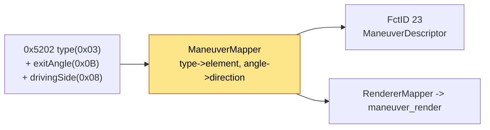

# Maneuver mapping - iAP2 type -> BAP descriptor

Turns the per-maneuver `0x5202` fields into a BAP `ManeuverDescriptor` (icon + direction + side
streets). Ground truth = `ManeuverMapper.map()`, validated against Apple's Maps/CarPlay 26.6 binaries.

## Context

> [[rgd-tlv]] - 0x5202 sub-TLVs -> **maneuver-mapping** - type+angle -> icon -> [[bap-fctids]] - FctID 23

## Inputs

- **Type** (`0x5202`/0x03) - `EManeuverType` 0-53, verified against MHI3 dio_manager
  `CDIONavigationMetadataTypeInfo::toString`.
- **JunctionElementExitAngle** (`0x5202`/0x0B) - signed BE16; `rgd_tlv.c` publishes it as both
  `turn_angle` and `exit_angle`. See [[rgd-tlv]].
- **drivingSide** (`0x5202`/0x08) - 0/1; side fallback when the angle is absent.

## Complete type -> BAP element table (0-53)

| # | EManeuverType | BAP mainElement | direction |
|---:|---|---|---|
| 0 | NO_TURN | FOLLOW_STREET | STRAIGHT |
| 1 | LEFT_TURN | TURN | LEFT |
| 2 | RIGHT_TURN | TURN | RIGHT |
| 3 | STRAIGHT_AHEAD | TURN | STRAIGHT |
| 4 | U_TURN | UTURN | signed (angle<0->L else R; side fallback) |
| 5 | FOLLOW_ROAD | FOLLOW_STREET | STRAIGHT |
| 6 | ENTER_ROUNDABOUT | TURN | L/R by driving side |
| 7 | EXIT_ROUNDABOUT | EXIT_ROUNDABOUT_TRS_L/R | L/R by driving side |
| 8 | OFF_RAMP | TURN | SLIGHT_L/R (side from angle sign, else driving side) |
| 9 | ON_RAMP | TURN | SLIGHT_L/R (same rule) |
| 10 | ARRIVE_END_OF_NAVIGATION | ARRIVED | STRAIGHT |
| 11 | START_ROUTE | TURN | `directionFromTurnAngle` |
| 12 | ARRIVE_AT_DESTINATION | ARRIVED | STRAIGHT |
| 13 | KEEP_LEFT | TURN | SLIGHT_LEFT |
| 14 | KEEP_RIGHT | TURN | SLIGHT_RIGHT |
| 15 | ENTER_FERRY | FOLLOW_STREET | STRAIGHT |
| 16 | EXIT_FERRY | TURN | `directionFromTurnAngle` |
| 17 | CHANGE_FERRY | FOLLOW_STREET | STRAIGHT |
| 18 | START_ROUTE_WITH_U_TURN | UTURN | signed |
| 19 | U_TURN_AT_ROUNDABOUT | ROUNDABOUT_TRS_L/R | UTURN |
| 20 | LEFT_TURN_AT_END | TURN | `dirFromEndOfRoadAngleLeft` |
| 21 | RIGHT_TURN_AT_END | TURN | `dirFromEndOfRoadAngleRight` |
| 22 | HIGHWAY_OFF_RAMP_LEFT | TURN | SLIGHT_LEFT (type wins over angle) |
| 23 | HIGHWAY_OFF_RAMP_RIGHT | TURN | SLIGHT_RIGHT (type wins over angle) |
| 24 | ARRIVE_DESTINATION_LEFT | ARRIVED | LEFT |
| 25 | ARRIVE_DESTINATION_RIGHT | ARRIVED | RIGHT |
| 26 | U_TURN_WHEN_POSSIBLE | UTURN | signed |
| 27 | ARRIVE_END_OF_DIRECTIONS | ARRIVED | STRAIGHT |
| 28-46 | ROUNDABOUT_EXIT_1 ... _19 | ROUNDABOUT_TRS_L/R | `directionFromAngle16(turnAngle)` |
| 47 | SHARP_LEFT_TURN | TURN | SHARP_LEFT |
| 48 | SHARP_RIGHT_TURN | TURN | SHARP_RIGHT |
| 49 | SLIGHT_LEFT_TURN | TURN | SLIGHT_LEFT |
| 50 | SLIGHT_RIGHT_TURN | TURN | SLIGHT_RIGHT |
| 51 | CHANGE_HIGHWAY | TURN | `directionFromTurnAngle` |
| 52 | CHANGE_HIGHWAY_LEFT | CHANGE_LANE | LEFT |
| 53 | CHANGE_HIGHWAY_RIGHT | CHANGE_LANE | RIGHT |

The `-1` `MT_NOT_SET` sentinel (the `RouteGuidance.State` default) -> `NO_SYMBOL / STRAIGHT`. The `255`
wire sentinel (`MAN_TYPE_NOT_SET` in `rgd_tlv.h`) and any type outside `0-53` are rejected by
`ManeuverMapper.isValidType()` in `BAPBridge` **before** `map()` is ever called. A valid in-range type
that falls through the switch (e.g. a roundabout-family type arriving with the wrong `junctionType`) ->
`NO_INFO / STRAIGHT`.

## Signed exit angle is the primary direction rule

Apple normalizes the junction angle sign per traffic side, in **both** maneuver builders
(`maneuverUpdateWithStep:` and `maneuverUpdateWithGuidanceEvent:`), ending in an `FNEG`:

| `drivingSide` | traffic side (`_descriptionForTrafficSide:`) | ordinary U-turn exit angle |
|---:|---|---|
| 0 | right | negative -> **left** U-turn |
| 1 | left | positive -> **right** U-turn |

So the receiver honours a **signed** angle for accNav types **4, 18, 26**; `drivingSide` is the
fallback when no role-2 angle is present. The `0/+/-1000 = absent` sentinel is our own convention
(Apple Maps 26.6 never synthesizes it). Apple collapses GEO 86/88 -> accNav 4; GEO 25/35 keep their
own signed angle. **Type 19 stays a roundabout, not a U-turn.**

## Ramps are one slight turn

`OFF_RAMP` / `ON_RAMP` / `HIGHWAY_OFF_RAMP_LEFT|RIGHT` all map to BAP `TURN` + `SLIGHT_L/R`. BAP
`EXIT_LEFT/RIGHT` is no longer used: even the base EXIT glyph adds a second bend back to straight,
geometry CarPlay's single angle does not describe. For types 8/9 the angle **sign** only picks the side
(`rampGoesLeft`; 0 and +/-1000 fall back to `drivingSide`); for 22/23 the side in the type wins even if
the angle conflicts. The renderer draws the same single bend and, for off-ramps, adds the continuing
main road (`RendererMapper.withForwardRoad`) - see [[maneuver-renderer]].

## Generic angle -> direction

`directionFromTurnAngle` (START_ROUTE, EXIT_FERRY, CHANGE_HIGHWAY) buckets at 45 deg: `<=22` straight,
`<=67` slight, `<=112` normal, else sharp; `|angle| > 180` keeps the old signed LEFT/RIGHT fallback.
`map(..., anglePresent)` treats a received `-1` as a real angle; only the legacy unfilled State slot
(`-1` without presence) is normalized to the `1000` "absent" sentinel. `LEFT/RIGHT_TURN_AT_END` keep
their end-of-road direction (not coarsened by the DSI override).

## Junction gate

For `junctionType != 0`, only the roundabout-exit family (`junctionType == 1`) is allowed through;
other junction types fall back so a non-roundabout maneuver never renders a roundabout icon.

## Product gap

`MAN_TLV_DESCRIPTION` (0x5202/0x02 InstructionText) is parsed but not surfaced on the cluster.
